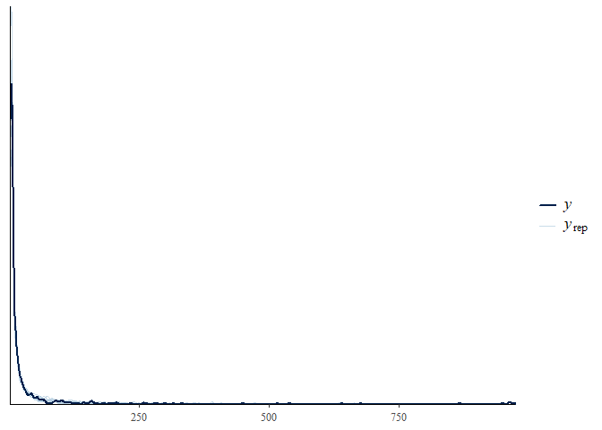

isdbayes: Bayesian hierarchical modeling of size spectra
================
Jeff Wesner
2023-10-04

## Overview

This package allows the estimation of power law exponents using the
truncated (upper and lower) Pareto distribution (Wesner et al. 2023).
Specifically, it allows users to fit Bayesian (non)-linear hierarchical
models with a truncated Pareto likelihood using `brms` (Bürkner 2017).
The motivation for the package was to estimate power law exponents of
ecological size spectra using individual-level body size data in a
generalized mixed model framework. The likelihood for the truncated
Pareto used here was described in (A. Edwards et al. 2020). This package
translates that likelihood into `brms`.

## Installation

This package requires installation of `brms` and `rstan`, which itself
requires installation of a C++ toolchain.

1)  Go to <https://mc-stan.org/users/interfaces/rstan.html> and follow
    the instructions to install `rstan` and configure the C++ toolchain.

2)  Install the latest version of `brms` with install.packages(“brms”).

3)  Install `isdbayes` from github using `devtools`:

``` r
# requires an installation of devtools

devtools::install_github("jswesner/isdbayes")
```

# Examples

## Fit individual samples

`isdbayes` amends the stanvars and family options in brms models to
accept the truncated Pareto. First, simulate some power law data using
the `rparetocounts()` function. The code below simulates 300 body sizes
from a power law with exponent (mu) = -1.2, xmin (vreal2) = 1, and xmax
(vreal3) = 1000. The options are called “mu”, “vreal2”, and “vreal3”
instead of “lambda”, “xmin”, and “xmax” to fit with the generic naming
requirements of `brms` for custom family distributions.

``` r
library(isdbayes)

# simulate data
dat = tibble(x = rparetocounts(n = 300,  mu = -1.2,  vreal2 = 1, vreal3 = 1000)) %>% 
  mutate(xmin = min(x),
         xmax = max(x),
         counts = 1)
```

The code above simulates data from a doubly-truncated Pareto and then
estimates xmin and xmax. It also adds a column for *counts.* If the data
all represent unique individual masses, then this column takes a value
of 1 for every body size. If the data have repeated sizes, then this
column can take an integer of the counts of those sizes. For example,
data that are x = {1.9, 1.9, 1.8, 2.8, 2.8} could either be analyzed
with each body size assumed to be unique where counts = {1, 1, 1, 1, 1}
or it could be analyzed as x = {1.9, 1.8, 2.8} and counts = {2, 1, 2}.
The latter is a common format when there is a density estimate
associated with counts or a sampling effort.

Next estimate the power law exponent using `brms`.

``` r
library(brms)

fit1 = brm(x | vreal(counts, xmin, xmax) ~ 1, 
          data = dat,
          stanvars = stanvars,    # required for truncated Pareto
          family = paretocounts(),# required for truncated Pareto
          chains = 1, iter = 1000)
```

This example fits an intercept-only model to estimate the power-law
exponent. For more complex examples with fixed and hierarchical
predictors, see below.

# Simulate multiple size distributions

``` r
library(isdbayes)
library(tidyverse)
library(brms)

x1 = rparetocounts(mu = -1.8) # `mu` is required wording from brms. in this case it means the lambda exponent of the ISD
x2 = rparetocounts(mu = -1.5)
x3 = rparetocounts(mu = -1.2)

isd_data = tibble(x1 = x1,
                  x2 = x2,
                  x3 = x3) %>% 
  pivot_longer(cols = everything(), names_to = "group", values_to = "x") %>% 
  group_by(group) %>% 
  mutate(xmin = min(x),
         xmax = max(x)) %>% 
  group_by(group, x) %>% 
  add_count(name = "counts")
```

# Fit multiple size distributions with a fixed factor

``` r
fit2 = brm(x | vreal(counts, xmin, xmax) ~ group, 
           data = isd_data,
           stanvars = stanvars,
           family = paretocounts(),
           chains = 1, iter = 1000)
```

# Plot group posteriors

``` r
posts_group = fit2$data %>% 
  distinct(group, xmin, xmax) %>% 
  mutate(counts = 1) %>% 
  tidybayes::add_epred_draws(fit2, re_formula = NA) 

posts_group %>% 
  ggplot(aes(x = group, y = .epred)) + 
  tidybayes::stat_halfeye(scale = 0.2) + 
  geom_hline(yintercept = c(-1.8, -1.5, -1.2)) # known lambdas
```

<!-- -->

# Fit multiple size distributions with a varying intercept

``` r
fit3 = brm(x | vreal(counts, xmin, xmax) ~ (1|group), 
           data = isd_data,
           stanvars = stanvars,
           family = paretocounts(),
           chains = 1, iter = 1000)
```

# Plot varying intercepts

``` r
posts_varint = fit3$data %>% 
  distinct(group, xmin, xmax) %>% 
  mutate(counts = 1) %>% 
  tidybayes::add_epred_draws(fit3, re_formula = NULL) 

posts_varint %>% 
  ggplot(aes(x = group, y = .epred)) + 
  tidybayes::stat_halfeye(scale = 0.2) + 
  geom_hline(yintercept = c(-1.8, -1.5, -1.2)) # known lambdas
```

<!-- -->

# Posterior predictive checks

After the model is fit, you can use built-in functions in brms to
perform model checking.

``` r
pp_check(fit2, type = "dens_overlay_grouped", group = "group")
#> Using 10 posterior draws for ppc type 'dens_overlay_grouped' by default.
```

<!-- -->

# Plotting the ISD

To plot the posterior against data, use plot_isd_posts() and then add
data with get_isd_data(). These plots follow the format of A. M. Edwards
et al. (2017), with body size values on the x-axis and the number of
values $\geq$ x (“n_yx”) on the y-axis.

``` r
# wrangle isd data for plotting
isd_dat = make_isd_data(fit2, group = group)

# plot posterior ISD with data overlaid
plot_isd_posts(fit2, group = group) + 
  geom_point(data = isd_dat)
```

<!-- -->

In the plot above, the posteriors are summarized with a median and 95%
Credible Interval. To access the underling posteriors, use
get_isd_posts()

``` r
# get ISD posteriors
isd_posts = get_isd_posts(fit2, group = group)

head(isd_posts)
#> # A tibble: 6 × 13
#> # Groups:   group, n [1]
#>   group     n     x  xmin  xmax counts  .row .chain .iteration .draw .epred
#>   <chr> <int> <dbl> <dbl> <dbl>  <dbl> <int>  <int>      <int> <int>  <dbl>
#> 1 x1      300  1.00  1.00  363.      1     1     NA         NA     1  -1.71
#> 2 x1      300  1.00  1.00  363.      1     1     NA         NA     2  -1.66
#> 3 x1      300  1.00  1.00  363.      1     1     NA         NA     3  -1.82
#> 4 x1      300  1.00  1.00  363.      1     1     NA         NA     4  -1.76
#> 5 x1      300  1.00  1.00  363.      1     1     NA         NA     5  -1.67
#> 6 x1      300  1.00  1.00  363.      1     1     NA         NA     6  -1.65
#> # ℹ 2 more variables: prob_yx <dbl>, n_yx <dbl>
```

Now we can plot the posterior draws individually.

``` r
# get ISD posteriors
isd_posts %>% 
  ggplot(aes(x = x, y = n_yx, group = interaction(group, .draw), color = group)) +
  geom_line()
```

<!-- -->

Adding log-scales to x

``` r
# get ISD posteriors
isd_posts %>% 
  ggplot(aes(x = x, y = n_yx, group = interaction(group, .draw), color = group)) +
  geom_line() +
  scale_x_log10()
```

<!-- -->

Adding log-scales to x and y requires cutting off at n_yx = 1 to avoid
plotting errors

``` r
# get ISD posteriors
isd_posts %>% 
  ggplot(aes(x = x, y = n_yx, group = interaction(group, .draw), color = group)) +
  geom_line() +
  scale_x_log10() +
  scale_y_log10() + 
  coord_cartesian(ylim = c(1, NA)) # this cuts of the y-axis. For the full posterior plot, remove scale_y_log10() the last line
```

<!-- --> \##
References

<div id="refs" class="references csl-bib-body hanging-indent">

<div id="ref-burkner2017brms" class="csl-entry">

Bürkner, Paul-Christian. 2017. “Brms: An r Package for Bayesian
Multilevel Models Using Stan.” *Journal of Statistical Software* 80:
1–28.

</div>

<div id="ref-edwards2020" class="csl-entry">

Edwards, Am, Jpw Robinson, Jl Blanchard, Jk Baum, and Mj Plank. 2020.
“Accounting for the Bin Structure of Data Removes Bias When Fitting Size
Spectra.” *Marine Ecology Progress Series* 636 (February): 19–33.
<https://doi.org/10.3354/meps13230>.

</div>

<div id="ref-edwards2017testing" class="csl-entry">

Edwards, Andrew M, James PW Robinson, Michael J Plank, Julia K Baum, and
Julia L Blanchard. 2017. “Testing and Recommending Methods for Fitting
Size Spectra to Data.” *Methods in Ecology and Evolution* 8 (1): 57–67.

</div>

<div id="ref-wesner2023bayesian" class="csl-entry">

Wesner, Jeff S, Justin PF Pomeranz, James R Junker, and Vojsava Gjoni.
2023. “Bayesian Hierarchical Modeling of Size Spectra.” *bioRxiv*,
2023–02.

</div>

</div>
