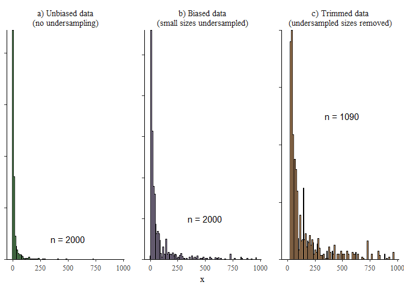

isdbayes: Bayesian hierarchical modeling of size spectra
================
Jeff Wesner

# Overview

This package allows the estimation of power law exponents using the
truncated (upper and lower) Pareto distribution (Wesner et al. 2024).
Specifically, it allows users to fit Bayesian (non)-linear hierarchical
models with a truncated Pareto likelihood using `brms` (Bürkner 2017).
The motivation for the package was to estimate power law exponents of
ecological size spectra using individual-level body size data in a
generalized mixed model framework. The likelihood for the truncated
Pareto used here was described in (Edwards et al. 2020). This package
translates that likelihood into `brms`.

# Installation

This package requires installation of `brms` and `rstan`, which itself
requires installation of a C++ toolchain.

1)  Go to <https://mc-stan.org/users/interfaces/rstan.html> and follow
    the instructions to install `rstan` and configure the C++ toolchain.

2)  Install the latest version of `brms` with install.packages(“brms”).

3)  Install `isdbayes` from github using `devtools`:

``` r
# requires an installation of devtools

devtools::install_github("jswesner/isdbayes")
```

# Examples

``` r
# load these packages

library(dplyr)
library(tidyr)
library(here)
library(ggplot2)
library(tidybayes)
library(brms)
library(isdbayes)
```

## Fit individual samples

First, simulate some power law data using `rparetocounts()`. The code
below simulates 300 body sizes from a power law with exponent lambda =
-1.2, xmin = 1, and xmax = 1000.

``` r
# simulate data

dat = tibble(x = rparetocounts(n = 300,  lambda = -1.2,  xmin = 1, xmax = 1000)) |> 
  mutate(xmin = min(x),
         xmax = max(x),
         counts = 1)
```

The code above simulates data from a doubly-truncated Pareto and then
estimates xmin and xmax. It also adds a column for *counts.* If the data
all represent unique individual masses, then this column takes a value
of 1 for every body size. If the data have repeated sizes, then this
column can take an integer or double of the counts or densities of those
sizes. For example, data that are x = {1.9, 1.9, 1.8, 2.8, 2.8} could
either be analyzed with each body size assumed to be unique where counts
= {1, 1, 1, 1, 1} or it could be analyzed as x = {1.9, 1.8, 2.8} and
counts = {2, 1, 2}. The latter is a common format when there is a
density estimate associated with counts or a sampling effort.

Next estimate the power law exponent using `brms`. The model below
(`fit1`) is an intercept only model, where x are the body sizes and
counts, xmin, and xmax are included in `vreal()`. The use of `vreal` has
nothing to do with the model per se. It is simply required wording from
`brms` when including custom families. Similarly, `stanvars` is required
wording that contains the custom likelihood parameters. As long as
`isdbayes` is loaded, then `stanvars = stanvars` will work. It will stay
the same regardless of changes to the model structure (like new
predictors or varying intercepts).

``` r

fit1 = brm(x | vreal(counts, xmin, xmax) ~ 1, 
          data = dat,
          stanvars = stanvars,    # required for truncated Pareto
          family = paretocounts(),# required for truncated Pareto
          chains = 1, iter = 1000)
```

This example fits an intercept-only model to estimate the power-law
exponent. For more complex examples with fixed and hierarchical
predictors, see below.

## Simulate multiple size distributions

``` r

x1 = rparetocounts(lambda = -1.8) # `lambda` is required wording from brms. in this case it means the lambda exponent of the ISD
x2 = rparetocounts(lambda = -1.5)
x3 = rparetocounts(lambda = -1.2)

isd_data = tibble(x1 = x1,
                  x2 = x2,
                  x3 = x3) |> 
  pivot_longer(cols = everything(), names_to = "group", values_to = "x") |> 
  group_by(group) |> 
  mutate(xmin = min(x),
         xmax = max(x)) |> 
  group_by(group, x) |> 
  add_count(name = "counts")
```

## Fit multiple size distributions with a fixed factor

``` r
fit2 = brm(x | vreal(counts, xmin, xmax) ~ group, 
           data = isd_data,
           stanvars = stanvars,
           family = paretocounts(),
           chains = 1, iter = 1000)
```

## Plot group posteriors

``` r
posts_group = fit2$data |> 
  distinct(group, xmin, xmax) |> 
  mutate(counts = 1) |> 
  add_epred_draws(fit2, re_formula = NA) 

posts_group |> 
  ggplot(aes(x = group, y = .epred)) + 
  stat_halfeye(scale = 0.2) + 
  geom_hline(yintercept = c(-1.8, -1.5, -1.2)) # known lambdas
```

<!-- -->

## Fit multiple size distributions with a varying intercept

``` r
fit3 = brm(x | vreal(counts, xmin, xmax) ~ (1|group), 
           data = isd_data,
           stanvars = stanvars,
           family = paretocounts(),
           chains = 1, iter = 1000)
```

## Plot varying intercepts

``` r
posts_varint = fit3$data |> 
  distinct(group, xmin, xmax) |> 
  mutate(counts = 1) |> 
  add_epred_draws(fit3, re_formula = NULL) 

posts_varint |> 
  ggplot(aes(x = group, y = .epred)) + 
  stat_halfeye(scale = 0.2) + 
  geom_hline(yintercept = c(-1.8, -1.5, -1.2)) # known lambdas
```

<!-- -->

## Posterior predictive checks

After the model is fit, you can use built-in functions in brms to
perform model checking.

``` r
pp_check(fit2)
#> Using 10 posterior draws for ppc type 'dens_overlay' by default.
```

<!-- -->

``` r

pp_check(fit2, type = "dens_overlay_grouped", group = "group") +
  scale_x_log10()
#> Using 10 posterior draws for ppc type 'dens_overlay_grouped' by default.
#> Warning in transformation$transform(x): NaNs produced
#> Warning in transformation$transform(x): NaNs produced
#> Warning: Removed 6 rows containing missing values or values outside the scale range
#> (`geom_segment()`).
```

<!-- -->

## Visualize ISD

This code extracts the cumulative probabilities using `pparetocounts()`
and the plots them over raw data. Note that the raw data probabilities
are simply estimates for visualization purposes. These plots are typical
in studies of the ISD and are visually similar to plots of log-abundance
vs log-size, making them more familiar to readers (maybe).

``` r
# 1) sort raw data
d = fit1$data |>
  arrange(-x) |> 
  mutate(order = row_number(),
         y_raw_prob = order/max(order)) # convert to 0-1 scale

# 2) data grid to sample over
data_grid = d |>
  distinct(xmin, xmax) |> 
  expand_grid(x = 2^seq(log2(min(d$x)), log2(max(d$x)), length.out = 30)) |> # sequence is log 2 to ensure equal logarithmic spacing
  mutate(counts = 1) # This is a default. Even if counts are >1 inthe raw data, make them = 1 here.

# 3) extract posteriors
isd_posts = data_grid |> 
  tidybayes::add_epred_draws(fit1)

# 4) get cumulative probabilities from posteriors
isd_lines = isd_posts |> 
  rowwise() |> 
  mutate(y_prob = pparetocounts(x = x, xmin = xmin ,xmax = xmax, lambda = .epred))

# 5) plot raw vs posterior samples
isd_lines |> 
  filter(.draw <= 100) |> # limits to the first 100 draws. Change as needed or use a summary to plot instead of individual lines
  ggplot(aes(x = x, y = y_prob)) + 
  geom_line(aes(group = .draw), alpha = 0.3) +
  geom_point(data = d, aes(y = y_raw_prob),
             shape = 21, fill = "white", color = "black") +
  labs(y = "P(X >= x)")
```

<!-- -->

## Addressing Undersampling

In field collections of body sizes, small organisms are commonly
undersampled. This contradicts that assumption of an exponential decline
in frequency as body size increases and can lead to dramatically poor
estimates of lambda (Clauset, Shalizi, and Newman 2009). For this
reason, we strongly recommend checking for and removing undersampled
small sizes. We show this below with simulated data

*Simulate data to show undersampling*

1)  Generate unbiased data using `rparetocounts()`

``` r
set.seed(4222)

# 1) sample 1000 body sizes
unbiased_data <- data.frame(x = rparetocounts(n = 2000, lambda = -1.5),
                            data = "unbiased data") |>
  arrange(x) |>
  mutate(id = 1:max(row_number()),
         counts = 1,
         xmin = min(x),
         xmax = max(x))
```

2)  Generate biased data by assigning low probabilities to small sizes
    and then re-sampling, weighted by the probability.

``` r
set.seed(4222)

# 2) create undersampling by resampling weighted by prob of occcurence
biased_data = unbiased_data |>
  mutate(prob = brms::inv_logit_scaled(seq(-20, 10, length.out = max(row_number())))) |> #this assigns low probabilities to the small stuff b/c sizes are arranged by size first in step 1
  sample_n(size = 2000, weight = prob, replace = T) |>  # resample with small things less probable
  mutate(data = "biased data") |>
  arrange(x) |>
  mutate(id = 1:max(row_number()),
         counts = 1,
         xmin = min(x),
         xmax = max(x))
```

3)  Find and remove biased sizes

How do we know if body sizes are undersampled? One option, which we
recommend, is to use the `estimate_xmin()` function from the `poweRlaw`
package (Gillespie 2015). It first fits the data to a power law
(unbounded, but that’s OK here). Then it uses Kolmogorov-Smirnoff
sampling to find the minimum size above which the data follow a power
law.

``` r
library(poweRlaw)

# fit a continuous power law using the poweRlaw package model (note it is not a truncated Pareto, but that is OK for these purposes)
temp_mod = conpl$new(biased_data$x)

# use estimate_xmin to determine the minimum size for which the data still follow a power law
xmin_est = estimate_xmin(temp_mod)$xmin

# remove sizes smaller than xmin
biased_data_fixed = biased_data |> filter(x >= xmin_est) |>
  mutate(xmin = min(x)) # don't forget to re-set xmin...very important!
```

`xmin_est` contains the minimum value, above which the data follow a
power law. In this case, it is 26.7. We removed all sizes below that.

The plot below shows these three data sets. Note the strong
undersampling in b) as shown by the small bar on the left. In c), these
values have been trimmed off and there is not white space below x =
26.7. Note that the trimming can be quite large despite the relatively
small `xmin_est` value. In this case, it removed less than 5% of the
data, but it can sometimes remove much more (such as 25 or 50%). That is
usually not a problem as long as the remaining data has enough
individuals to fit reliably, usually 300 or so.

``` r

set.seed(20202)
library(tidyverse)
data_to_plot = bind_rows(
  unbiased_data |> mutate(data = "a) Unbiased data\n(no undersampling)"),
  biased_data |> mutate(data = "b) Biased data\n(small sizes undersampled)"),
  biased_data_fixed |> mutate(data = "c) Trimmed data\n(undersampled sizes removed)")
)

sample_sizes = data_to_plot |>
  group_by(data) |>
  tally() |>
  mutate(n = paste("n =", n))

ggplot(data_to_plot, aes(x = x, fill = data)) + 
  geom_histogram(bins = 100, color = 'black') +
  # facet_wrap(~data, scales = "free_y") +
  # brms::theme_default() +
  # theme(axis.text.y = element_blank(),
  #       axis.title.y = element_blank()) +
  # guides(fill = "none") +
  # scale_fill_brewer(type = "qual") +
  # scale_y_continuous(expand = c(0, NA)) +
  # geom_text(data = sample_sizes, aes(x = 500, y = 100, label = n)) +
  NULL
```

<!-- -->

*Undersampling effects on lambda*

Now we estimate lambda from the three data sets and compare the fits.

``` r

fit_unbiased = update(fit1, newdata = unbiased_data)
#> 
#> SAMPLING FOR MODEL 'anon_model' NOW (CHAIN 1).
#> Chain 1: 
#> Chain 1: Gradient evaluation took 0.001322 seconds
#> Chain 1: 1000 transitions using 10 leapfrog steps per transition would take 13.22 seconds.
#> Chain 1: Adjust your expectations accordingly!
#> Chain 1: 
#> Chain 1: 
#> Chain 1: Iteration:   1 / 1000 [  0%]  (Warmup)
#> Chain 1: Iteration: 100 / 1000 [ 10%]  (Warmup)
#> Chain 1: Iteration: 200 / 1000 [ 20%]  (Warmup)
#> Chain 1: Iteration: 300 / 1000 [ 30%]  (Warmup)
#> Chain 1: Iteration: 400 / 1000 [ 40%]  (Warmup)
#> Chain 1: Iteration: 500 / 1000 [ 50%]  (Warmup)
#> Chain 1: Iteration: 501 / 1000 [ 50%]  (Sampling)
#> Chain 1: Iteration: 600 / 1000 [ 60%]  (Sampling)
#> Chain 1: Iteration: 700 / 1000 [ 70%]  (Sampling)
#> Chain 1: Iteration: 800 / 1000 [ 80%]  (Sampling)
#> Chain 1: Iteration: 900 / 1000 [ 90%]  (Sampling)
#> Chain 1: Iteration: 1000 / 1000 [100%]  (Sampling)
#> Chain 1: 
#> Chain 1:  Elapsed Time: 2.123 seconds (Warm-up)
#> Chain 1:                1.744 seconds (Sampling)
#> Chain 1:                3.867 seconds (Total)
#> Chain 1:
fit_biased = update(fit1, newdata = biased_data)
#> 
#> SAMPLING FOR MODEL 'anon_model' NOW (CHAIN 1).
#> Chain 1: 
#> Chain 1: Gradient evaluation took 0.000912 seconds
#> Chain 1: 1000 transitions using 10 leapfrog steps per transition would take 9.12 seconds.
#> Chain 1: Adjust your expectations accordingly!
#> Chain 1: 
#> Chain 1: 
#> Chain 1: Iteration:   1 / 1000 [  0%]  (Warmup)
#> Chain 1: Iteration: 100 / 1000 [ 10%]  (Warmup)
#> Chain 1: Iteration: 200 / 1000 [ 20%]  (Warmup)
#> Chain 1: Iteration: 300 / 1000 [ 30%]  (Warmup)
#> Chain 1: Iteration: 400 / 1000 [ 40%]  (Warmup)
#> Chain 1: Iteration: 500 / 1000 [ 50%]  (Warmup)
#> Chain 1: Iteration: 501 / 1000 [ 50%]  (Sampling)
#> Chain 1: Iteration: 600 / 1000 [ 60%]  (Sampling)
#> Chain 1: Iteration: 700 / 1000 [ 70%]  (Sampling)
#> Chain 1: Iteration: 800 / 1000 [ 80%]  (Sampling)
#> Chain 1: Iteration: 900 / 1000 [ 90%]  (Sampling)
#> Chain 1: Iteration: 1000 / 1000 [100%]  (Sampling)
#> Chain 1: 
#> Chain 1:  Elapsed Time: 2.141 seconds (Warm-up)
#> Chain 1:                2.343 seconds (Sampling)
#> Chain 1:                4.484 seconds (Total)
#> Chain 1:
fit_trimmed = update(fit1, newdata = biased_data_fixed)
#> 
#> SAMPLING FOR MODEL 'anon_model' NOW (CHAIN 1).
#> Chain 1: 
#> Chain 1: Gradient evaluation took 0.000825 seconds
#> Chain 1: 1000 transitions using 10 leapfrog steps per transition would take 8.25 seconds.
#> Chain 1: Adjust your expectations accordingly!
#> Chain 1: 
#> Chain 1: 
#> Chain 1: Iteration:   1 / 1000 [  0%]  (Warmup)
#> Chain 1: Iteration: 100 / 1000 [ 10%]  (Warmup)
#> Chain 1: Iteration: 200 / 1000 [ 20%]  (Warmup)
#> Chain 1: Iteration: 300 / 1000 [ 30%]  (Warmup)
#> Chain 1: Iteration: 400 / 1000 [ 40%]  (Warmup)
#> Chain 1: Iteration: 500 / 1000 [ 50%]  (Warmup)
#> Chain 1: Iteration: 501 / 1000 [ 50%]  (Sampling)
#> Chain 1: Iteration: 600 / 1000 [ 60%]  (Sampling)
#> Chain 1: Iteration: 700 / 1000 [ 70%]  (Sampling)
#> Chain 1: Iteration: 800 / 1000 [ 80%]  (Sampling)
#> Chain 1: Iteration: 900 / 1000 [ 90%]  (Sampling)
#> Chain 1: Iteration: 1000 / 1000 [100%]  (Sampling)
#> Chain 1: 
#> Chain 1:  Elapsed Time: 1.087 seconds (Warm-up)
#> Chain 1:                0.966 seconds (Sampling)
#> Chain 1:                2.053 seconds (Total)
#> Chain 1:
```

    #> # A tibble: 3 × 7
    #>   data            n Target_lambda Estimate Est.Error `l-95% CI` `u-95% CI`
    #>   <chr>       <int>         <dbl>    <dbl>     <dbl>      <dbl>      <dbl>
    #> 1 a) Unbiased  2000          -1.5    -1.49    0.0151      -1.52      -1.46
    #> 2 b) Biased    2000          -1.5    -1.15    0.0136      -1.18      -1.13
    #> 3 c) Trimmed   1090          -1.5    -1.54    0.0322      -1.61      -1.48

This shows the target lambda value along with the posterior median
`Estimate`, error, and upper an lower credible intervals. As expected,
the model with unbiased data performs well, recapturing the known
lambda. The model with biased data performs poorly, with the credible
intervals nowhere close to the true lambda. Note the drastic mis-fit
that occurs even though the biased samples occur only in the very
smallest individuals (i.e., 26.7/1000 = 2.5%). After trimming those
individuals out, the model again recaptures lambda well.

*What about multiple samples?*

The trimming procedure is sample-specific, not global. So if you have
multiple samples, then you’ll need to run the `estimate_xmin` procedure
on each sample, trim with a unique `xmin_est`, and recalculate xmin for
each sample.

## References

<div id="refs" class="references csl-bib-body hanging-indent"
entry-spacing="0">

<div id="ref-burkner2017brms" class="csl-entry">

Bürkner, Paul-Christian. 2017. “Brms: An r Package for Bayesian
Multilevel Models Using Stan.” *Journal of Statistical Software* 80:
1–28.

</div>

<div id="ref-clauset2009power" class="csl-entry">

Clauset, Aaron, Cosma Rohilla Shalizi, and Mark EJ Newman. 2009.
“Power-Law Distributions in Empirical Data.” *SIAM Review* 51 (4):
661–703.

</div>

<div id="ref-edwards2020" class="csl-entry">

Edwards, Am, Jpw Robinson, Jl Blanchard, Jk Baum, and Mj Plank. 2020.
“Accounting for the Bin Structure of Data Removes Bias When Fitting Size
Spectra.” *Marine Ecology Progress Series* 636 (February): 19–33.
<https://doi.org/10.3354/meps13230>.

</div>

<div id="ref-Gillespie_powerlaw" class="csl-entry">

Gillespie, Colin S. 2015. “Fitting Heavy Tailed Distributions: The
<span class="nocase">poweRlaw</span> Package.” *Journal of Statistical
Software* 64 (2): 1–16. <https://doi.org/10.18637/jss.v064.i02>.

</div>

<div id="ref-wesner2024bayesian" class="csl-entry">

Wesner, Jeff S, Justin PF Pomeranz, James R Junker, and Vojsava Gjoni.
2024. “Bayesian Hierarchical Modelling of Size Spectra.” *Methods in
Ecology and Evolution* 15 (5): 856–67.

</div>

</div>
